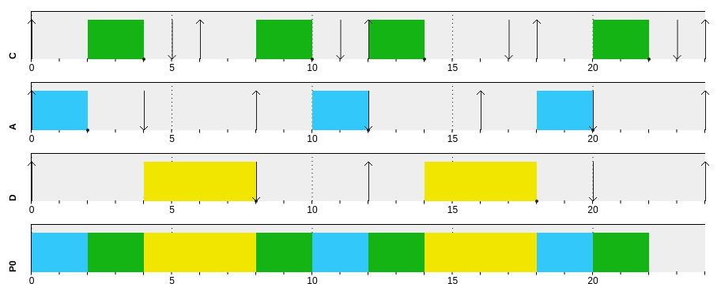

# MiROS STM32F103C8T6

This project contains a heavily modified version of MiROS that uses an EDF (Earliest Deadline First) scheduler. Given the choice to implement a RM (Rate Monotonic), DM (Deadline Monotonic) or EDF scheduler, the EDF was chosen for it's expandability and ease of implementation.

It has support for periodic tasks with specific deadlines. It's possible to create a non-periodic thread by setting its period to zero.

The working principle is the global tick counter `os_ticks` and the `activation_time` variable contained in each task's TCB (Thread Control Block). This structure was chosen because if the `activation_time` is in the future, the task has not yet been activated; if it's in the past, the thread is active and its absolute deadline can be calculated by adding `deadline` to the `activation_time`; thus making it simple to calculate everything the scheduler needs.

Having each active thread's absolute deadline, when the scheduler is called, it searches for the earliest one, and switches to it. Upon terminating execution, the task `period` is added to its `activation_time`.

## Tracer
This project also contains a tracer in `tools/tracer.py`. Using matplotlib and pyserial, it's possible to visualize when and for how long each thread is executing.

It's necessary to adjust the `traceds` list in the Python script based on your task set and  define `OS_DEBUG_USART` when compiling.

There's also the possibility to use an oscilloscope or a logic analyzer to debug your tasks. Make sure to set the define `OS_DEBUG_GPIO`, and then hook up your probes to each thread's debug pin. The debug pins reside in GPIO A, and their number is the threads ID (0 for the idle thread, and then assigned incrementally for each configured thread).

## Example

The following task set:

|Task    |Computation Time|Deadline|Period|
|--------|----------------|--------|------|
|Correr  |               2|       5|     6|
|Água    |               2|       4|     8|
|Descanso|               4|       8|    12|

[SimSo](https://projects.laas.fr/simso/simso-web) yields the following results:

And after being run on this operating system, this is the output from `tracer.py`:

And this is the output from PulseView, a logic analyzer:

## Compiling

You need `make`, `arm-none-eabi-gcc`, and `openocd` to build and flash this project. The Makefile has a `monitor` target, that by defaults uses GNU Screen to monitor the serial port.
